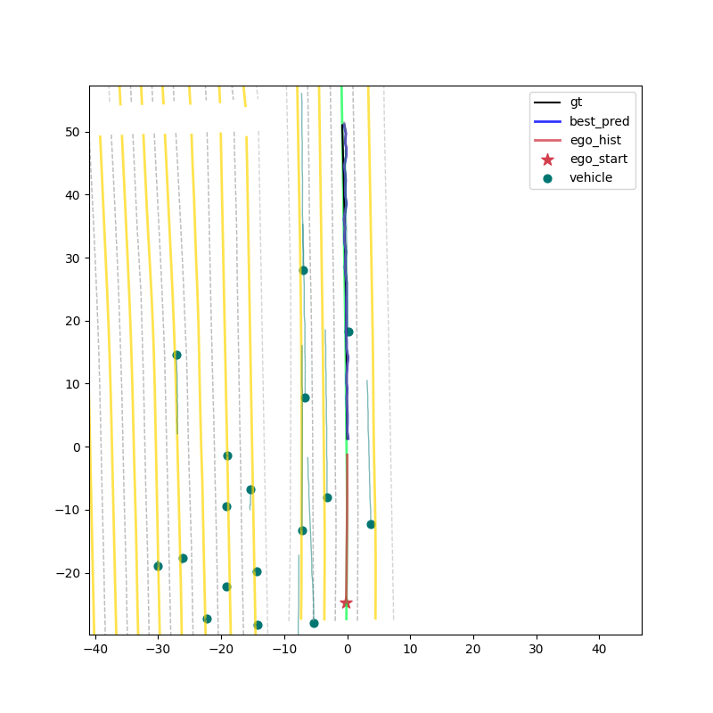
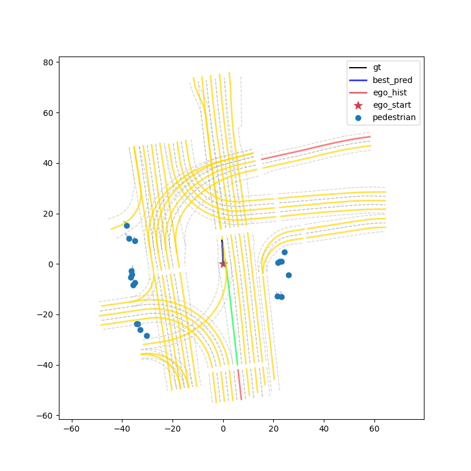
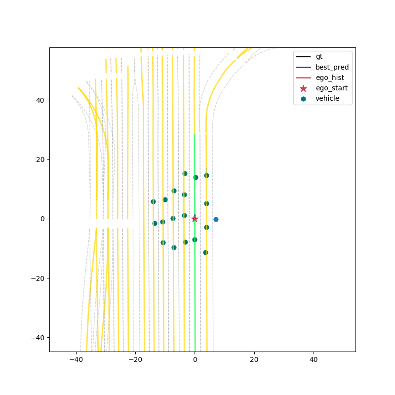
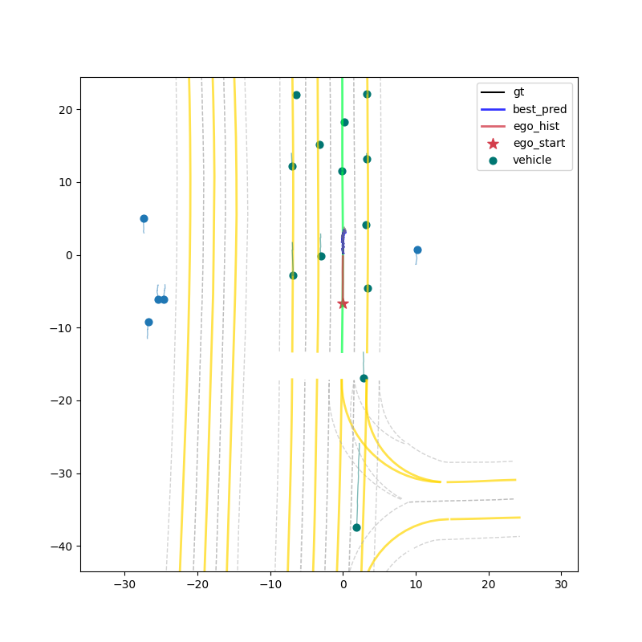
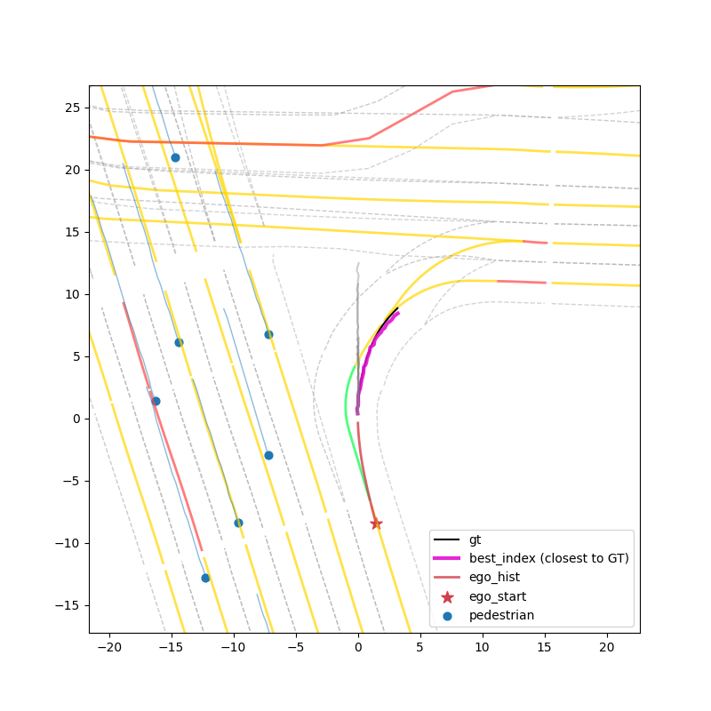
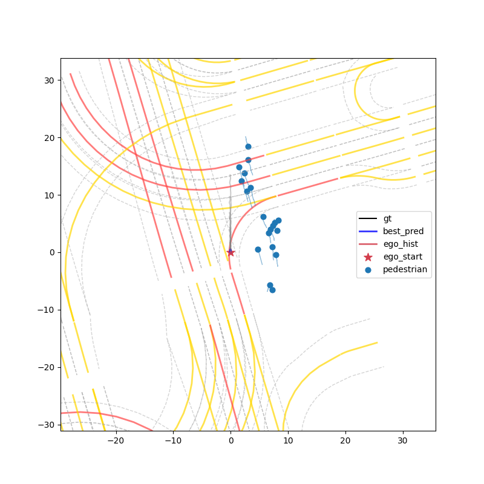
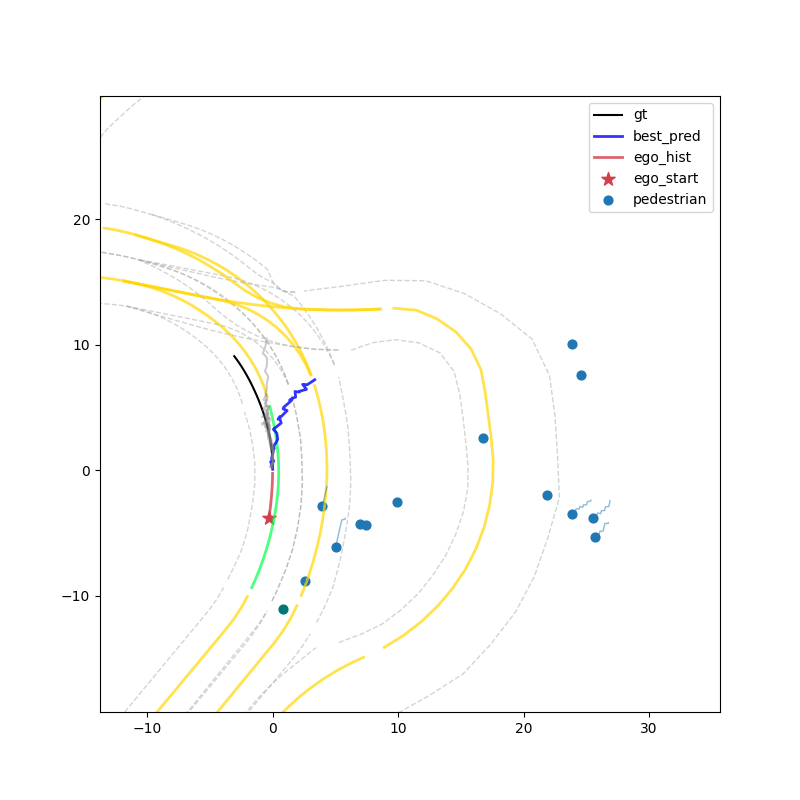
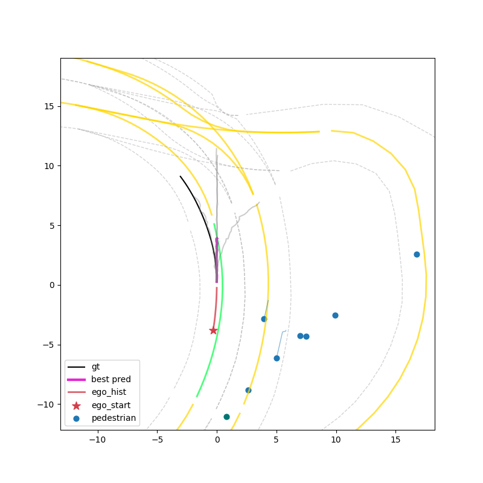

# Wayformer:A Simple, Efficient Motion Prediction Network

**This is a self-implementation of Wayformer based on Nuplan dataset, the original paper link:[Wayformer](https://arxiv.org/abs/2207.05844).**
## Highlights:
1. Wayformer official source code is not available, I studied and reproduced every methods in the original paper and tested its performance on open sourced dataset, this work can be a good reference for those who want to learn motion forecasting for AVs.
2. Improved model performance. Added positional encoding before earlyfusion, relace random queries with ego vehicle history trajectory feature + multimodal longitudinal proposals. This to some degree helps the model to predict multi-modality. The model finally achieves fADE6:0.82,mADE:0.33,MR:0.09 on nuplan mini split.
3. Added other loss functions(L1-smooth, log-prob gaussian) and fine-tune their weights at different training stage to regulate output trajectories and probabilities, smoothness and drivable routes are more encouraged.
### Updates:
2025.8.9  Modified `Wayformer.py` and `utils.py` to replace full ego car history with dropout features(imitation learning's limits), correct the "best index" expression, use the traj with the highest score provided by Wayformer instead of that is the closest to GT. Adjust pred horizon to 3s

2025.8.16  Added [StateAttnEncoder](Wayformer/state_attention_encoder.py), this was inspired by [PLUTO](https://github.com/jchengai/pluto), only dropout acceleration/steering data to avoid info loss. Use learnable embeddings as road type embedding.

2025 8.24  Removed Mode2mode attention in `utils.py`, because this will make training process unstable.
## Environment Set Up
Setup the nuPlan dataset following the [offiical-doc](https://nuplan-devkit.readthedocs.io/en/latest/dataset_setup.html). Prepare conda environment:
```shell
conda create -n wayformer python=3.8
conda activate wayformer
git clone git@github.com:fuingcrazy/Wayformer-NuPlan.git
pip install -r ./requirements.txt

# install nuplan-devkit
git clone https://github.com/motional/nuplan-devkit.git && cd nuplan-devkit
pip install -e .
pip install -r ./requirements.txt
```
Please modify your dataset and output path in [config file](Wayformer/wayformer_config.py)
## Preprocess Data
This model uses preprocessed mappings as input, so we need to read nuplan raw data(scenarios) and convert them into the format we want.
```python
cd Wayformer_Nuplan && conda activate wayformer
python nuplan_data_processor
```

After running commands above, you should have 3 files in `/config` directory:
```
└── config
    └── ex_list_nuplan_train.pkl
    └── ex_list_nuplan_val.pkl
    └── wayformer.1.json
```

## Training
Once you have your pkl files, you can start training your model with
```python
python train_wf.py
```

## Validation && Visualization
All training logs can be found in `output/wayformer.1/version_n`, you will find 2 checkpoint files under `/checkpoints` directory, we use `last.ckpt` to evaluate out model. For instance:
```python
python eval.py --ckpt '{YOUR_HOME_DIR}/Wayformer_NuPlan/output/wayformer.1/version_0/checkpoints/last.ckpt'
```
You can dowload pretrained ckpt file [Here](https://drive.google.com/file/d/1_xw9segYT10SlrG9RPisYX4rm98_-pA9/view?usp=sharing)
You will see visualization results pop out:

**Forward:**



**Merge**



**Stop**



**Break**



**Right Turn**



**Pedestrain**



**Fail cases**





## Reviews
1. The model still has some problems on predicting multi-modality, probably due to the lack of scenario diversity in the mini split of Nuplan and anchor-free query design.
2. In left/right turn scenarios, the trajectories become less smooth and feasible when reaching there ends, this means the model is inconfident when forecasting long term turning. Again, the most part of this dataset is just "keep going forward", the modal tends to converge to this pattern to avoid penalties.
